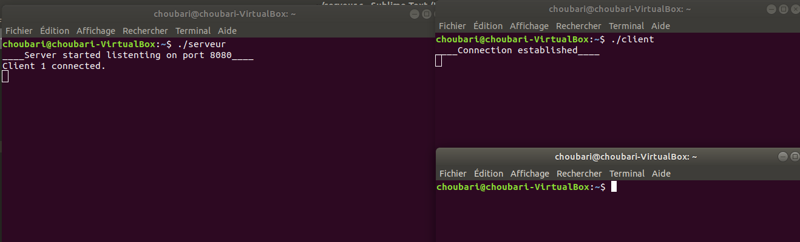
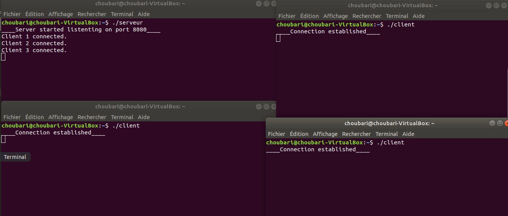
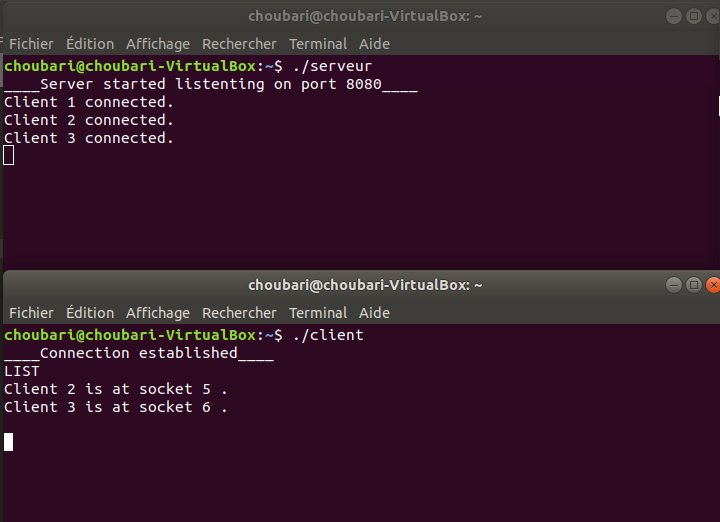
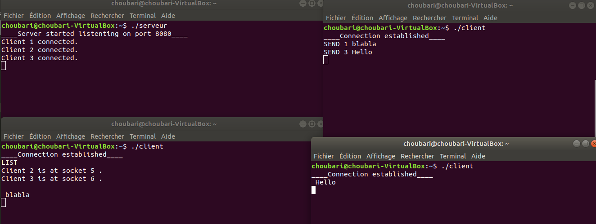

# Client-Server-Chat-Application

Chat Application (Client-Server) using C language, sockets and threads.

Compiling files :

* Serveur :
`
gcc serveur.c -pthread  -o serveur -w
`
* Client :
`
gcc client.c -pthread  -o client -w
`
Executing the code, connection established :

  

3 Clients connected to the server:

  

Listing the clients that are connected to the server with the command **LIST**:

  

Sending message to a client with the command **SEND X Message** (X is the id number of the client):

  

